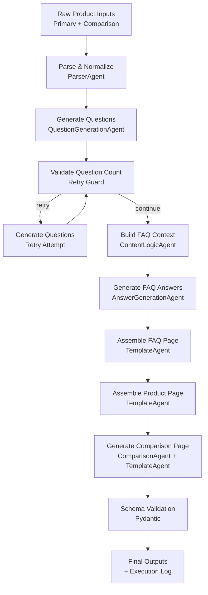
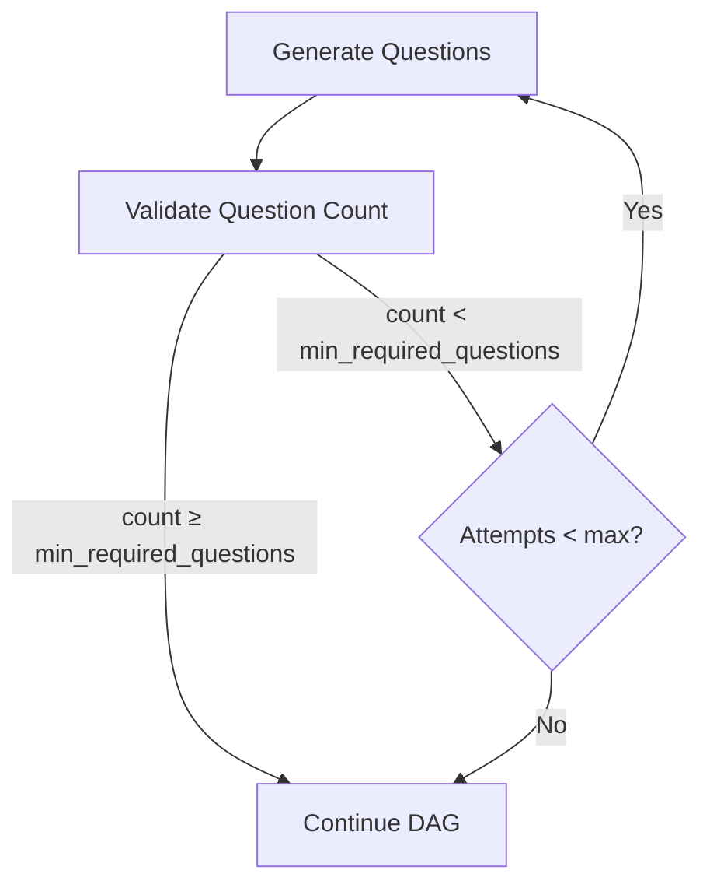
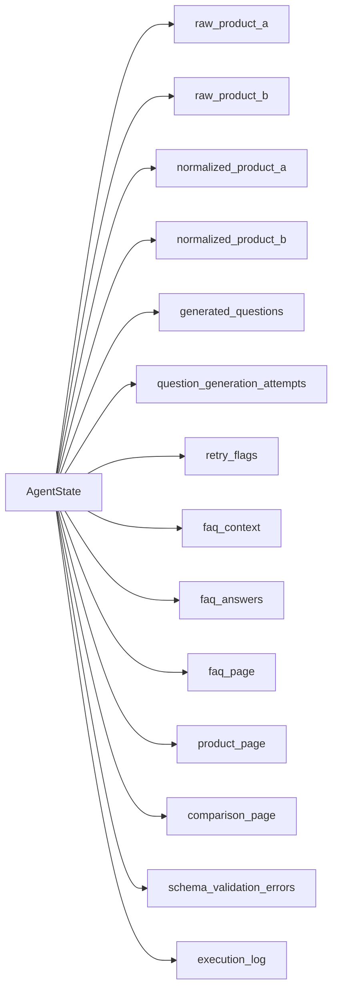
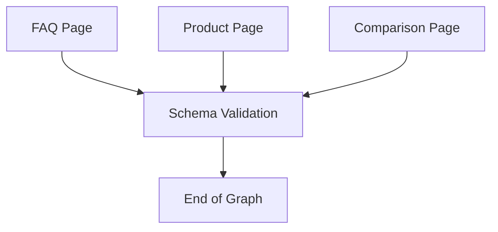
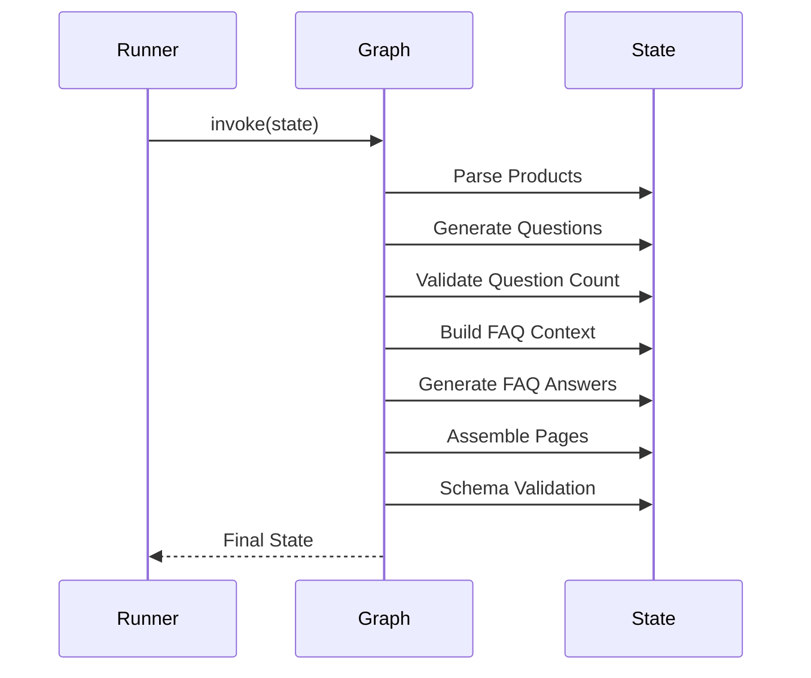

# System Diagrams – Kasparro Agentic Content Generation System

This document describes the **LangGraph-based orchestration** used in the Kasparro Agentic Content Generation System.  

---

## 1. High-Level LangGraph DAG 

The system is orchestrated as a **directed acyclic graph (DAG)** managed entirely by LangGraph.  
There is **no custom sequential orchestration** and no agent-to-agent control flow.



---

## 2. Conditional Routing & Retry Logic 

Question generation is protected by a **retry guard** implemented via LangGraph conditional edges.



Key properties:
- Retry attempts are stored in shared state
- Maximum retries are enforced
- No infinite loops are possible
- Routing decisions are separated from state mutation

---

## 3. Shared State Flow

A single `AgentState` object flows through all nodes.



This ensures transparency, debuggability, replayability, and framework-level observability.

---

## 4. Schema Validation Gate 

Before termination, all outputs pass through a **schema validation node**.



- Validation is performed using **Pydantic schemas**
- Errors are captured in state
- The graph completes gracefully even on validation failure

---

## 5. Execution Logging

Each node appends a human-readable entry to the execution log.



The execution log is persisted to:
```
data/output/execution_log.txt
```

---