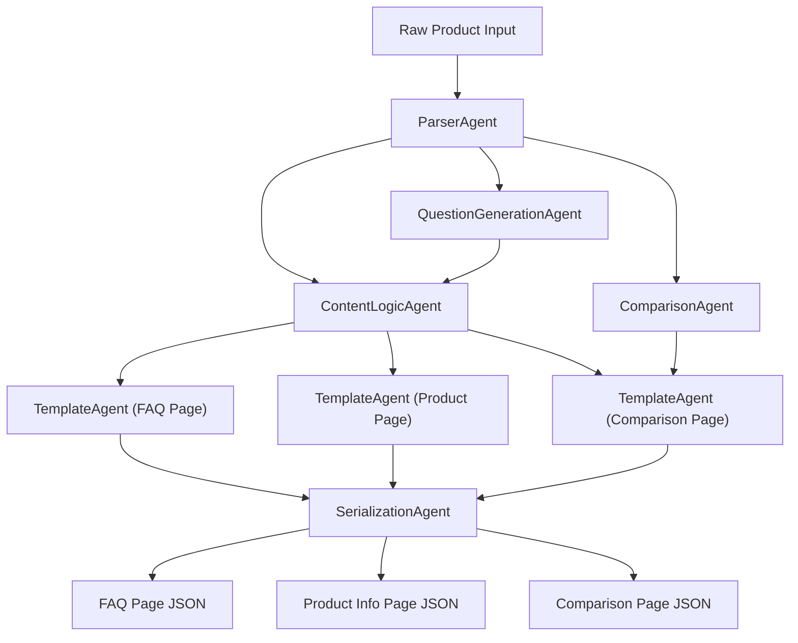
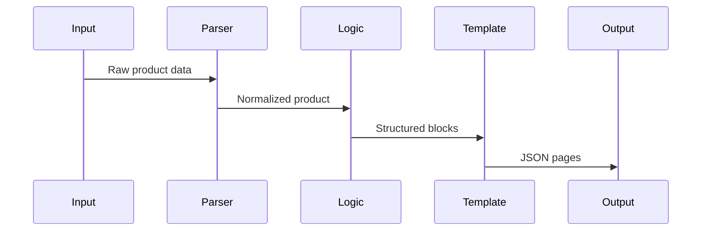

# System Diagrams (Mermaid)

## Orchestration DAG

```mermaid
flowchart TD
    A[Raw Product Input]
    B[ParserAgent]
    C[QuestionGenerationAgent]
    D[ContentLogicAgent]
    E[ComparisonAgent]

    F["TemplateAgent (FAQ Page)"]
    G1["TemplateAgent (Product Page)"]
    G2["TemplateAgent (Comparison Page)"]

    H[SerializationAgent]
    J[FAQ Page JSON]
    K[Product Info Page JSON]
    L[Comparison Page JSON]

    A --> B
    B --> C
    B --> D
    B --> E

    C --> D

    D --> F
    D --> G1
    D --> G2
    E --> G2

    F --> H
    G1 --> H
    G2 --> H

    H --> J
    H --> K
    H --> L

```

---

## Execution Direction

```mermaid
sequenceDiagram
    participant Input
    participant Parser
    participant Logic
    participant Template
    participant Output

    Input->>Parser: Raw product data
    Parser->>Logic: Normalized product
    Logic->>Template: Structured blocks
    Template->>Output: JSON pages
```
